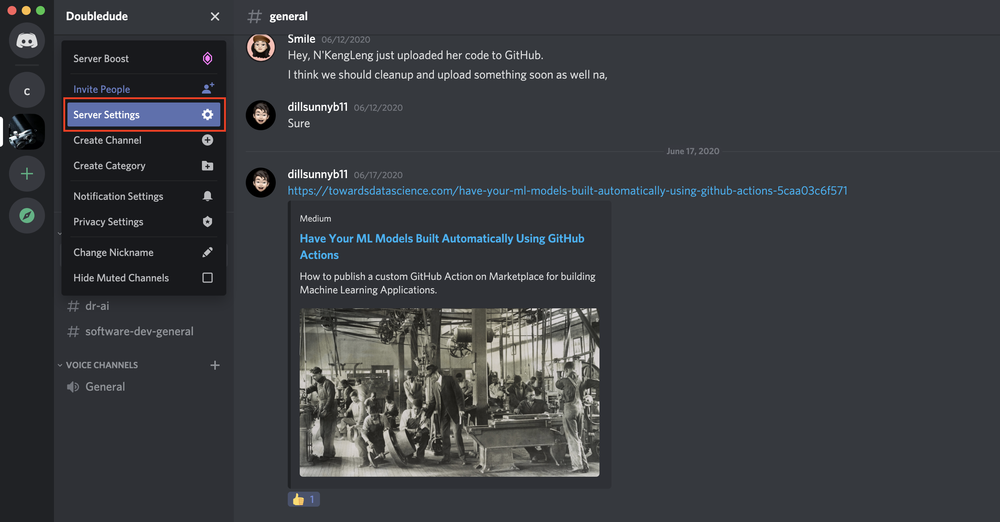
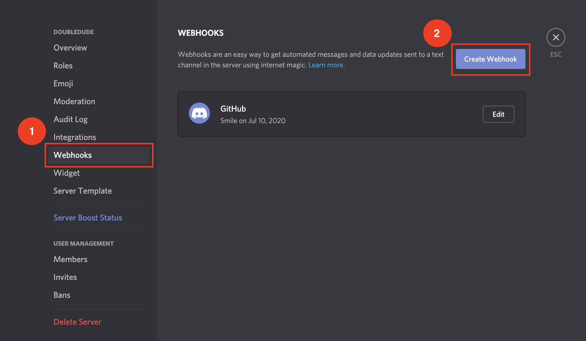
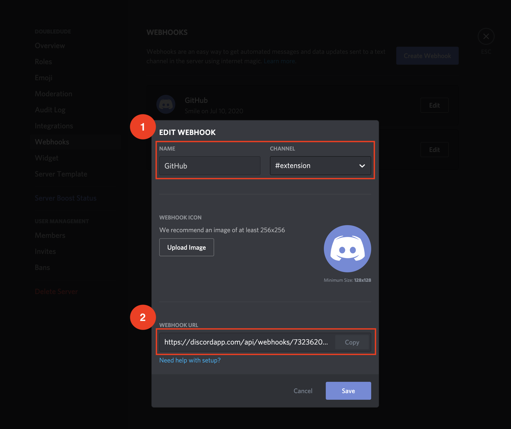
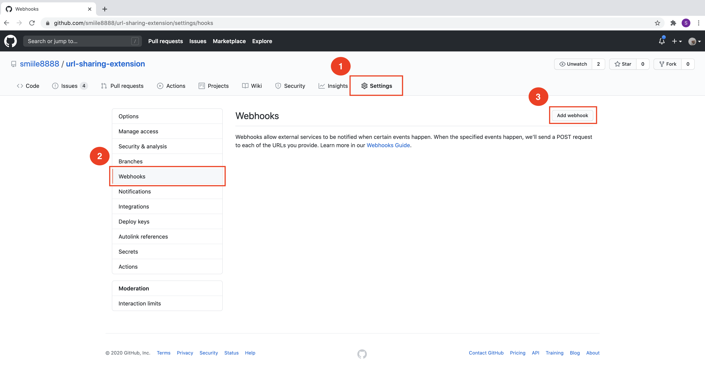
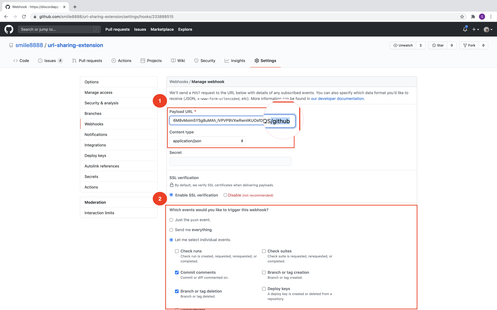
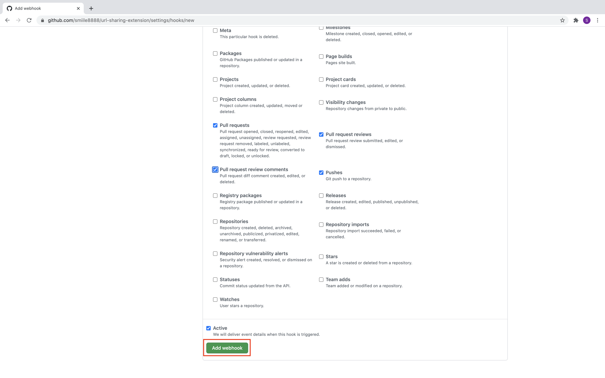
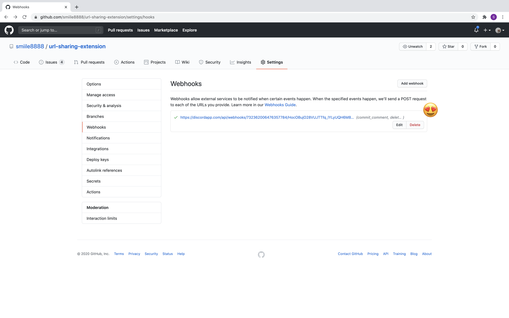
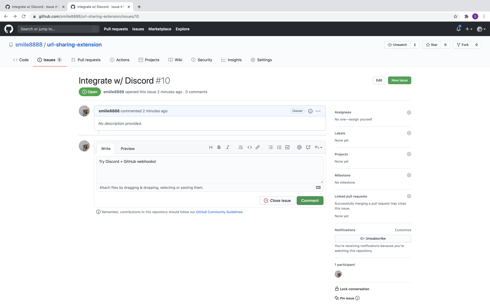
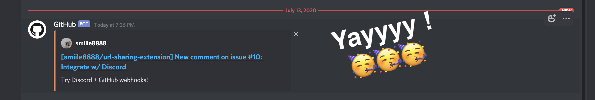

# discord-github-webhook

After working in the company for a while and have leanred a lot from the team, I got inspired to do an integration between Discord and GitHub because we use Discord as the main communication channel and it'd be nice if we can have a cutie bot shouting out to us whenever coworker has done the PR.

I did some research and found nothing in particular for Discord helping this task, unlike Slack that has many supporting add-ons.

One simple way to automate the task is using Webhook connecting between Discord channel and GitHub repo. Here is the steps for setting up:

1. Setting up Webhook URL from your Discord server
    - Go to `Server Settings`
    
    - Go to `Webhooks`, click `Create Webhook`
    
    - Set up name, channel you want the webhook to send message to
    - Copy the Webhook URL
    
    
    **Note:** you can set up Webhook only on the server that you have the permission (in my case I own the server).

2. Setting up GitHub Webhook
    - Go to `Settings` on your repository
    - Go to `Webhooks`, click `Add webhook`
    
    - Paste the discord webhook URL on `Payload` field, and add `/github` (__DO NOT__ forget to add `/github`)
    - Choose `application/json` for `Content type`
    - Next, select the events to trigger the webhook.
    There is a lot for you to choose. You can select whatever you want ;)
    In my case, for the demo purpose, I select as shown in the attached image. (__Note:__ you can edit the setting later on, so don't worry!)
    
    - Then click `Add webhook`
    
    - Hoorey, you now finish setting up
    

It's time to try it out!

I will add a comment to the issue, then GitHub should technically send a message to my discord channel.

Yayy! the message is immediately sent over.

